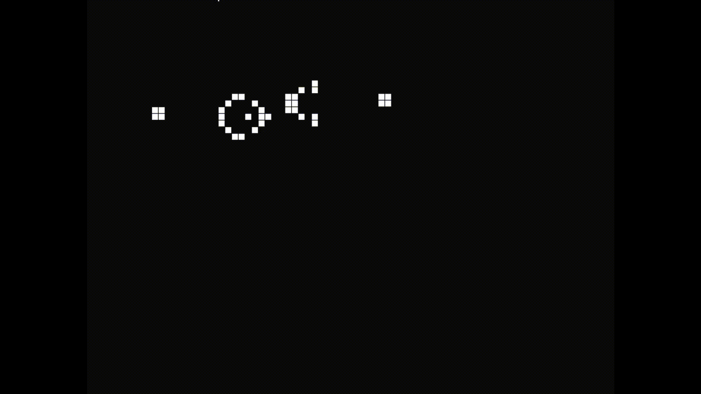
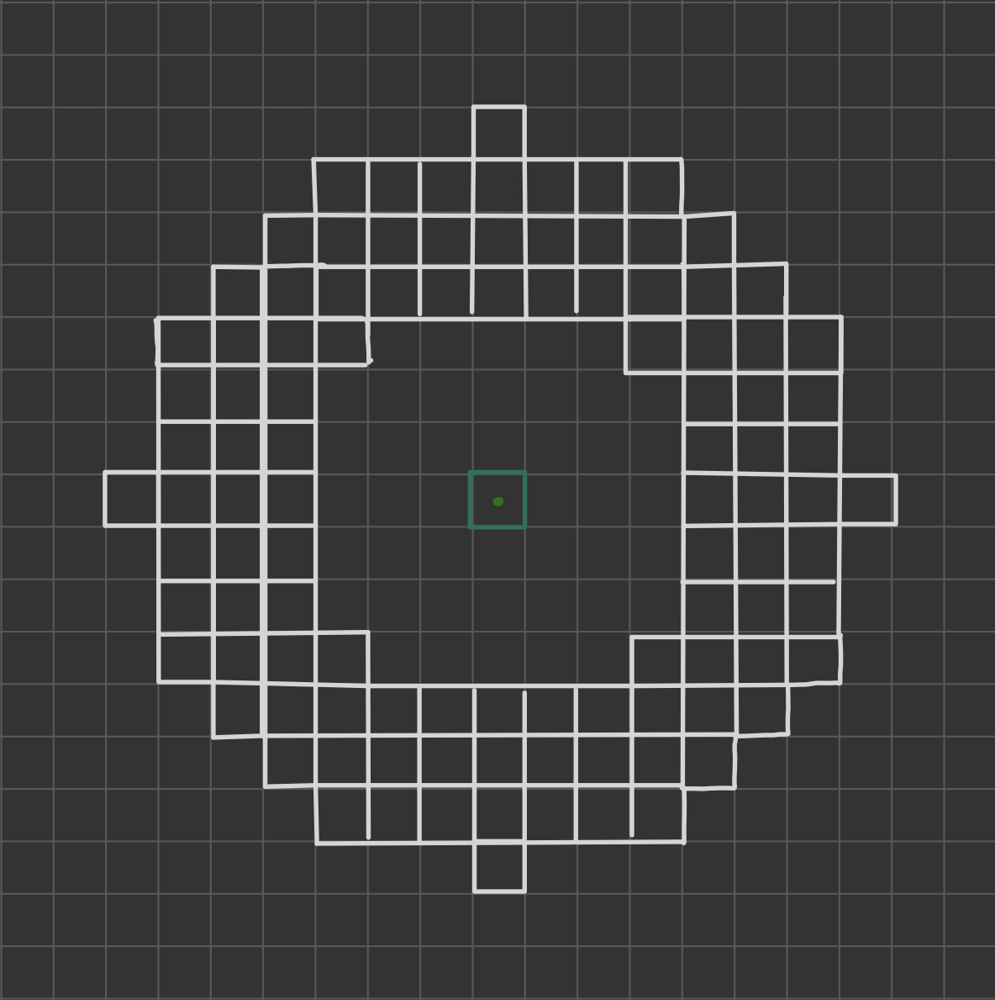
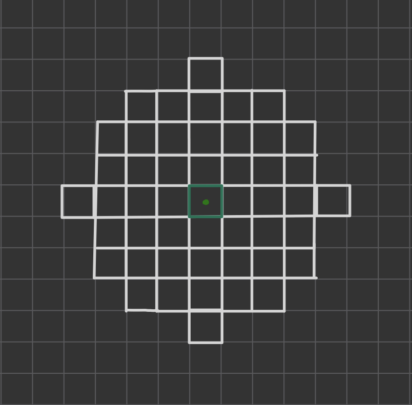

# Multiple Neighbourhood Cellular Automata
MNCA is inspired by Conway's Game of Life, cellular automaton. Since the creating of The Game of Life in 1970, people found 
many configurations that exhibit emergent behaviour. Emergent behaviour describes complex systems with intricate properties that weren't explicitly encoded but rather are a result of the interaction of system's simpler components. 

The Game of Life consists of simple rules:
* Any live cell with fewer than 2 live neighbours dies, as if by underpopulation.
* Any live cell with 2 or 3 live neighbours lives on to the next generation.
* Any live cell with more than 3 live neighbours dies, as if by overpopulation.
* Any dead cell with exactly 3 live neighbours becomes a live cell, as if by reproduction.

In its majority, those rules produce states that eventually die out or are locked in a forever repeating simple cycle (e.g. the 4 adjecent cells forming a square will forever remain in that form). However, certain cofigurations produce behaviour that creates complex structures. For example, Gosper glider gun, the first gun to be found. 

A glider gun produces infinite number of gliders. It has complex and periodic behaviour. 

The emergence that occurs within the Game of Life gave rise to an idea of trying to work not just with cellular automaton, but with Multiple Neighbourhood Cellular Automata. By changing the boundary conditions and adjusting rules of the Game, incredible patterns can be found. 
The following emergent behaviour simulates a life form, a cellular organism:

https://github.com/user-attachments/assets/7c8d8bb6-9299-47b4-a937-d47ed5a19bc1

I created the pattern by considering the following two sets of neighbourhoods.  

  

The same sets of neighbourhoods can give rise to a different behaviour under different rules.

https://github.com/user-attachments/assets/7e44371d-12e7-49cb-9dea-c7a2003651ee

To achieve the "worm" pattern shown, I needed to adjust a single value in the rules for the "cells" pattern just by 1. MNCA are incredibly sensitive to the initial conditions, which is also a reason for the increadible complexity they produce. 

While playing with different rules for the neighbourhood condition above, I came across the following behaviour that reminds me of hydrothermal vents. 

https://github.com/user-attachments/assets/08350f6e-9dbb-4a02-9b89-40318c07c957
